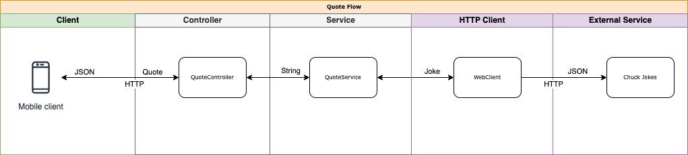

# Springboot to Native Running Container

## Objective show in 1 hour some common spring layers and turning that code into a native running container

## Layers of the simple Quote Service 

### Steps taken to accomplish this project.
- Visit chuck norris joke site https://api.chucknorris.io/jokes/random?category=dev to see output.
- QuoteApplication the starting point for the WebFlux application.
- Config Class to retrieve joke in reactive call.
  - Write the Test for the renderApiErrorResponse for the Filter in the Reactive webclient.
      - Do not want to expose the chuck api to the calling client when errors take place.
      - We also want to log it so we can debug and do RCA.
- Joke Record to store the returned joke and log its original url.
- QuoteService Interface the contract to retrieve quote with supplied name.
- Specific Concrete implementation NameReplaceQuoteGenerator Class implements QuoteService using chuck norris website to supply the verbiage. 
  - Write the Test for this specific implementation that replaces chuck with supplied name in chuck joke.
- Quote Record the contract to the outside Rest contract.
- WebFlux QuoteController Class to return the Quote to the caller.
  - Write the Controller test to make sure different names would be replaced
    - Take note that this test only tests out the flow not the actually replacing. very nice showing layer separation.
- Build the application using the [Native Build Starter image thanks to Mark Sailes](native-builder-starter.sh) base image is AWS runtime linux.
- Build docker image for Quote Service [Script to build the docker image](docker/image.sh) this uses the produced binary built on the AWS linux in docker from last step.
- Run the container using [Run Container Script](run-container.sh) see how fast the image starts up.

